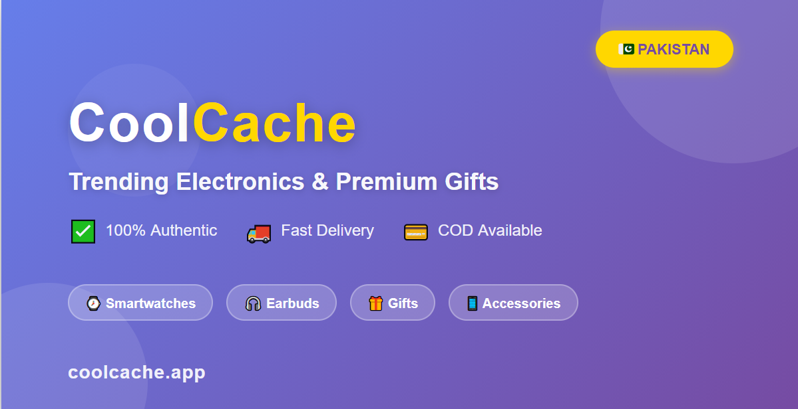

# Next.js E-Commerce Template (Premium)

A high-performance, neutral-themed e-commerce template built with Next.js 14, Tailwind CSS, and React Query. Designed for speed, conversion, and easy customization.



## 🚀 Key Features

- **⚡ Blazing Fast**: Built on Next.js 14 with server-side rendering and optimized image loading.
- **🎨 White-Label Ready**: Easily change colors, logos, and fonts to match your brand.
- **📱 PWA Supported**: Installable as a native app on mobile devices.
- **🛒 Smart Cart**: Features free shipping progress bar and sticky cart for mobile.
- **🔍 Advanced Search**: Real-time search with debouncing and history.
- **🛡️ Admin Panel**: Built-in dashboard for managing products and orders.

## 🛠️ Installation

1.  **Clone the repository**
    ```bash
    git clone https://github.com/hadeedhussainmemon/E-commerce-Store.git
    cd E-commerce-Store
    ```

2.  **Install dependencies**
    ```bash
    npm install
    ```

3.  **Configure Environment**
    Copy `.env.example` to `.env.local` and add your API keys.
    ```env
    NEXT_PUBLIC_API_BASE_URL=https://your-api.com
    ```

4.  **Run Locally**
    ```bash
    npm run dev
    ```
    Visit `http://localhost:3000`.

## ⚙️ Configuration

We have centralized all major settings in `src/config.js`.

### 1. Branding & Socials
Open `src/config.js` to change:
- App Name
- Contact Email/Phone
- Social Media Links (Instagram, WhatsApp)

### 2. Currency
Change the currency symbol and code in `src/config.js`:
```javascript
currency: {
    symbol: "Rs.", // Change to "$", "€", etc.
    code: "PKR",
    locale: "en-PK"
}
```

### 3. Theming (Colors)
To change the primary brand color:
1.  Open `tailwind.config.js`.
2.  Modify the `primary` color object colors.
3.  (Optional) Use Find & Replace to swap `text-purple-600` with `text-primary-600` in the `src` folder.

## 📦 Deployment

This app is optimized for **Vercel**.

1.  Push your code to GitHub.
2.  Import the project in Vercel.
3.  Add your `NEXT_PUBLIC_API_BASE_URL` environment variable.
4.  Click **Deploy**.

## 📄 License

[Add your license details here, e.g., Commercial License]

---
*Built with ❤️ by CoolCache Team*
